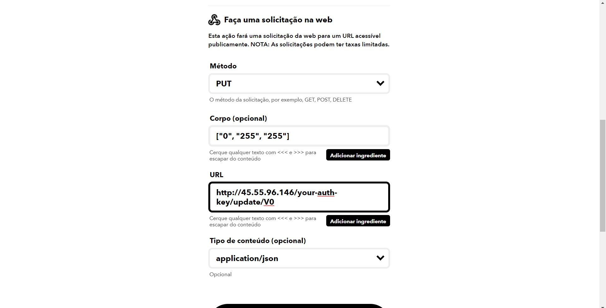
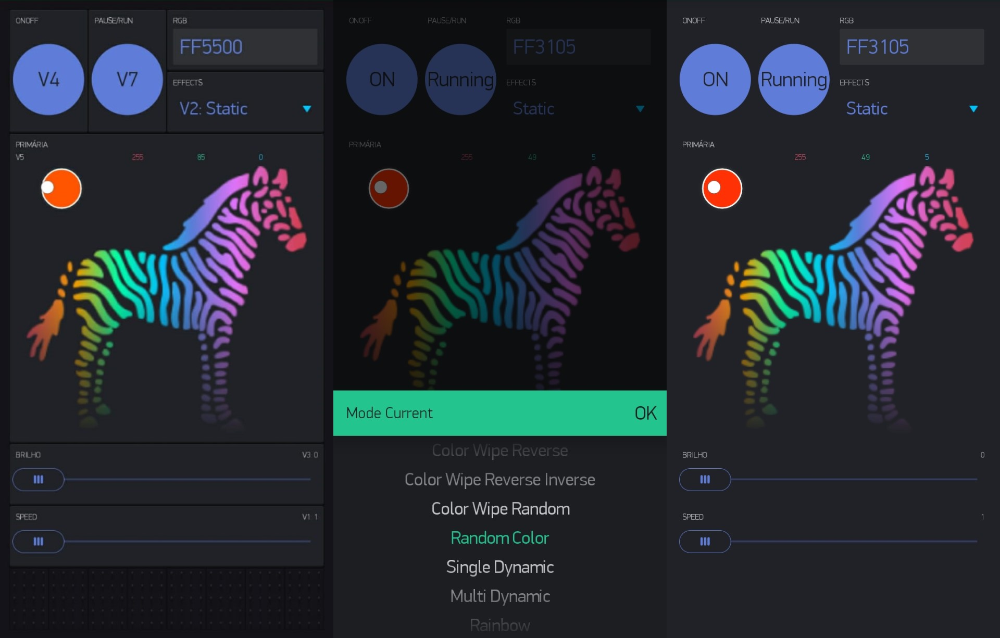
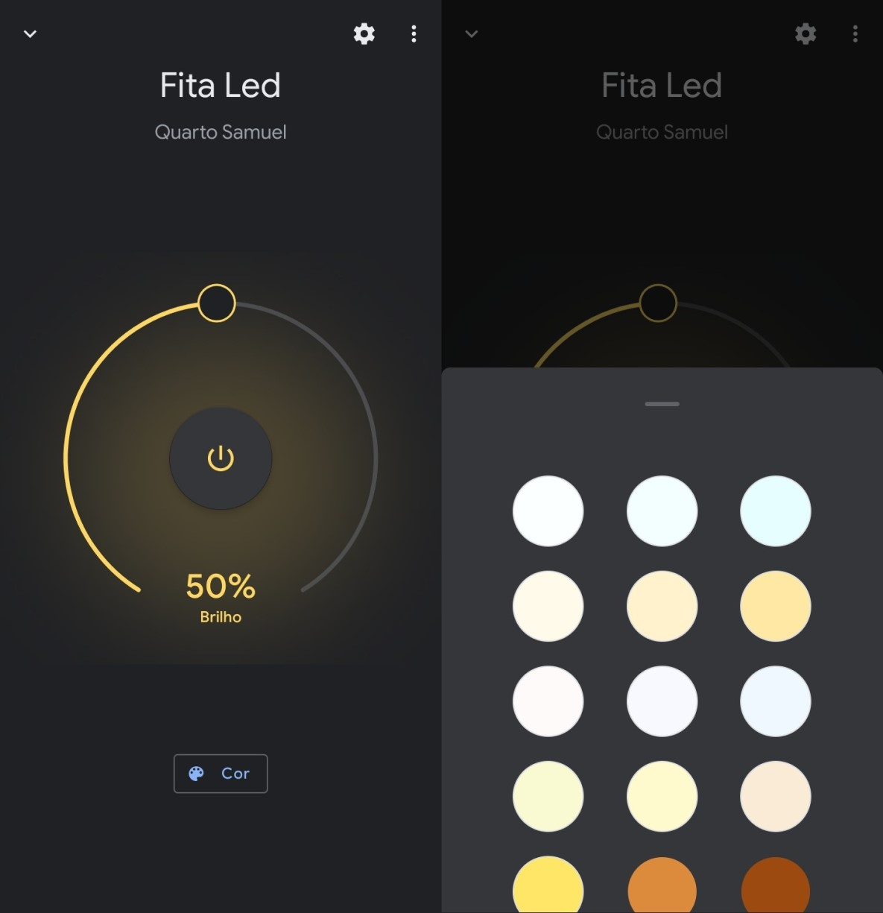

# My-Strip-Led-With-Google-Home-And-Blynk

## Descrição do Projeto:

 Minha solução para usar uma fita led endereçável(ws2812b), podendo ser controlada pelo Google Assistente, como pelo aplicativo da Blynk, ainda podendo criar gatilho para notificações externas. 

### Motivação:

Recentemente, comprei uma fita led! Quando ela chegou, fiquei bastante desapontado. O controle remoto e a controladora, eram muito limitados, tinham poucas opções de cores, efeitos e o seu custo era muito alto... Além de não ter a possibilidade de controlar a fita pela internet! Assim, comecei minha saga para criar uma fita que atingisse minhas necessidade e me permitisse, implementar qualquer coisa. 

### Meus objetivos eram:

- Controlar a fita pela internet!
- Controlar a fita por um aplicativo personalizado!
- Controlar a fita pelo Google Assistant (pelo Google Home tambem)!

### Historia do projeto:

Bom, para iniciar o desenvolvimento do meu projeto, sabia que teria que utilizar de  algum embarcado que possibilitasse, a conexão com a internet. Desta forma, escolhi a placa NodeMcu V3, para controlar minha fita. Pelo sua potencia de processamento e seu alto custo-beneficio!

Neste momento, já conseguia controlar a fita pela Biblioteca NeoPixel, o que para mim, já era um enorme ganho de desempenho. Mas, a criação de cada efeito manualmente, estava demandando muito tempo. Parti para o github, na busca de uma Biblioteca alternativa a NeoPixel, foi quando achei a WS2812FX, que usa como base a NeoPixel, mas adiciona vários efeitos. Além de ser muito bem construida!

Com o controlador bem desenvolvido, comecei a pensar em soluções para o controle usando a internet. Depois de diversas tentativas, achei duas plataformas que se completam perfeitamente! A Sinric e a Blynk! A Sinric, é uma biblioteca que viabiliza a comunicação entre projetos IOT, com as Assistentes Virtuais Alexa e Google Assistant. Assim, consigo receber e interpretar todos os gatilhos vindo da Sinric, tornando a fita, mais inteligente. A Blynk, se tornou util dando suporte as funções que a Sinric não suportava, como por exemplo: Efeitos, velocidade dos efeitos, um picker color mais simples...

E por fim, descobri como usar o servidor da Blynk junto ao IFTTT, permitindo a integração com diversos aplicativos e plataformas.  Segue o exemplo:

Pegando o Accent Color do Windows e jogando na fita:

### Interface da Blynk:

 ### Interface do Google Home:

