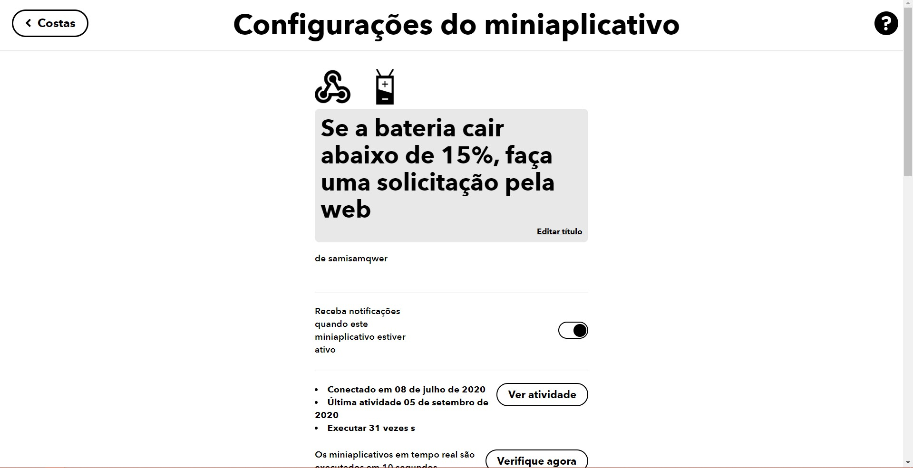

# My-Strip-Led-With-Google-Home-And-Blynk

## Descrição do Projeto:

Minha solução para usar uma fita led endereçável (ws2812b), podendo ser controlada pelo Google Assistente, como pelo aplicativo da Blynk, ainda podendo criar gatilho para notificações externas.

## Motivação:

Recentemente, comprei uma fita led! Quando ela chegou, fiquei bastante desapontado. O controle remoto e a controladora, eram muito limitados, tinham poucas opções de cores, efeitos e o seu custo era muito alto... Além de não ter a possibilidade de controlar a fita pela internet! Assim, comecei minha saga para criar uma fita que atingisse minhas necessidade e me permitisse, implementar qualquer coisa. 

## Meus objetivos eram:

- Controlar a fita pela internet!
- Controlar a fita por um aplicativo personalizado!
- Controlar a fita pelo Google Assistant (pelo Google Home tambem)!

## Pré-requisitos:

- Uma fita led Ws2812b, ou similar.
- Um NodeMcu V3.
- Realizar o cadastro na [Sinric]
- Realizar o cadastro na [Blynk] e copiar a interface da descrição, respeitando as portas virtuais!

## Historia do projeto:

Bom, para iniciar o desenvolvimento do meu projeto, sabia que teria que utilizar de  algum embarcado que possibilitasse, a conexão com a internet. Desta forma, escolhi a placa NodeMcu V3, para controlar minha fita. Pelo sua potencia de processamento e seu alto custo-beneficio!

Neste momento, já conseguia controlar a fita pela Biblioteca NeoPixel, o que para mim, já era um enorme ganho de desempenho. Mas, a criação de cada efeito manualmente, estava demandando muito tempo. Parti para o github, na busca de uma Biblioteca alternativa a NeoPixel, foi quando achei a [WS2812FX], que usa como base a NeoPixel, mas adiciona vários efeitos. Além de ser muito bem construida!

Com o controlador bem desenvolvido, comecei a pensar em soluções para o controle usando a internet. Depois de diversas tentativas, achei duas plataformas que se completam perfeitamente! A [Sinric] e a [Blynk]! A [Sinric], é uma biblioteca que viabiliza a comunicação entre projetos IOT, com as Assistentes Virtuais Alexa e Google Assistant. Assim, consigo receber e interpretar todos os gatilhos vindo da [Sinric], tornando a fita, mais inteligente. A [Blynk], se tornou util dando suporte as funções que a [Sinric] não suportava, como por exemplo: Efeitos, velocidade dos efeitos, um picker color mais simples...

## Projeto:

## Exemplos de aplicações:

### Usando Triggers do IFTTT para notificação:

Descobri como usar o servidor da [Blynk] junto ao [IFTTT] como um serviço RESTful, permitindo a integração com diversos aplicativos e plataformas.

É possivel utilizar qualquer gatilho disponibilizado na plataforma. Primeiro, deverá criar uma ação personalizada, clicando em "Create", escolha o gatilho que desejar. E para a ação desejada, escolha o WebHooks. 

Você, deverá utilizar a URL: https://45.55.96.146/your-auth-key/update/porta-para-qual-deseja-enviar-a-cor

Atraves, do metódo PUT, você enviará no Header, o Content-type sendo 'application/json', e no Body, uma lista contendo a cor desejada para o efeito de notificação, seguindo o padrão RGB.

O exemplo abaixo, indica uma notificação para informar quando o celular estiver descarregando.

 

### Pegando a cor primária do Windows e jogando na fita:

Link para o repositório:
[Script-Python-Color-Windows]

## Interfaces:

### Interface da Blynk:

 ### Interface do Google Home:

[Script-Python-Color-Windows]: https://github.com/SamueldaCostaAraujoNunes/ColorWindowsLed

[Sinric]: https://github.com/kakopappa/sinric

[WS2812FX]: https://github.com/kitesurfer1404/WS2812FX

[Blynk]: https://blynk.io/

[IFTTT]: https://ifttt.com/home